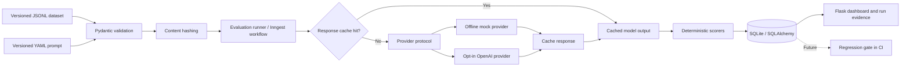
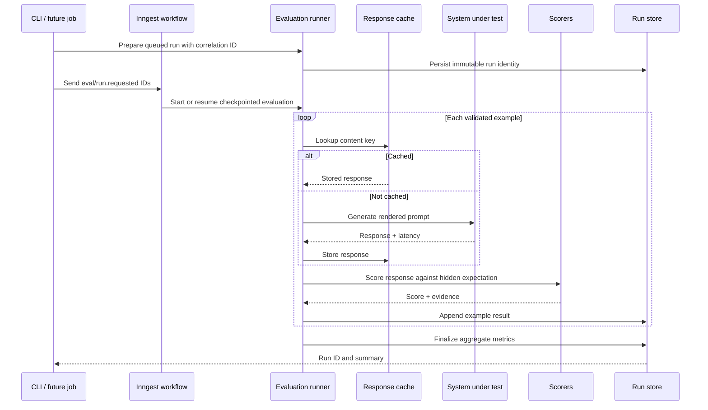
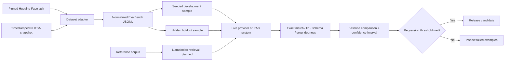

# EvalBench

**A reproducible LLM evaluation and regression platform for testing answer quality before model changes reach production.**


EvalBench turns datasets, prompt versions, provider settings, and scoring rules into traceable evaluation runs. It stores per-example evidence, reuses identical responses through content-addressed caching, and makes regressions inspectable from a Flask dashboard.

The default evaluation path is deliberately offline and deterministic. It proves that the infrastructure works without API keys or paid model calls. Phase 2 added an opt-in OpenAI Responses API adapter, a reproducible Hugging Face importer, and pinned SQuAD v2 and HotpotQA samples. The adapter is contract-tested but has not been credentialed smoke-tested; RAG and statistical model comparisons remain planned work.

## Why this project exists

LLM demos often show a handful of successful answers but cannot answer the engineering questions that matter in production:

- Did a prompt or model change improve quality across a fixed test set?
- Can every score be traced to the exact dataset, prompt, provider, and configuration?
- Are repeated runs reproducible, cacheable, and inexpensive?
- Which examples regressed, and why did a scorer fail them?
- Can the same evaluation run in CI before a release?

EvalBench is designed around those questions. It emphasizes measurable behavior, immutable run history, explicit failure evidence, and honest separation between deterministic checks and model-based judgment.

## Verified capabilities

| Capability | Evidence in the current repository |
|---|---|
| Versioned evaluation data | Validated automotive JSONL examples with a dataset content hash |
| External dataset provenance | Eight SQuAD v2 and HotpotQA fixtures pinned to source rows and repository revisions |
| Versioned prompts | YAML prompt registry with variable validation and a prompt content hash |
| Provider abstraction | Offline mock plus an opt-in, contract-tested OpenAI Responses API adapter |
| Deterministic scoring | Exact match, token F1, answerability, and JSON Schema with readable evidence |
| Reproducibility | Dataset hashes and versioned prompt/provider identities are stored per run; cache keys hash the exact prompt, provider, dataset subset, and example |
| Response caching | Identical requests are served from a content-addressed SQLite cache |
| Audit trail | Append-only run summaries, per-example results, and persisted correlation IDs |
| Durable workflow execution | Inngest validation, generation, scoring, and atomic completion checkpoints with idempotent database replay protection |
| Safe failure finalization | Exhausted retries produce categorized, sanitized diagnostics while preserving completed runs and partial evidence |
| Web observability | Run dashboard, run-detail view, liveness, and database readiness routes |
| Local quality gate | Ninety-six automated tests and Ruff static analysis pass locally |

## Architecture pipeline



The Flask routes only handle HTTP concerns. Dataset loading, prompt rendering, providers, scoring, caching, and run orchestration live in framework-independent modules so they can also be used by the CLI, background jobs, and future CI workflows.

## Evaluation workflow

### Compare completed runs (Phase 4)

The paired comparison engine reports candidate-minus-baseline score and pass-rate
changes, plus improved, regressed, unchanged, newly passing, and newly failing
examples. It reads existing results without generating responses or changing runs:

```python
from evalbench import create_app
from evalbench.comparisons import compare_runs
from evalbench.extensions import db
from evalbench.models import EvaluationRun

app = create_app()
with app.app_context():
    baseline = db.session.get(EvaluationRun, "<baseline-run-id>")
    candidate = db.session.get(EvaluationRun, "<candidate-run-id>")
    if baseline is None or candidate is None:
        raise ValueError("Choose two existing run IDs from the dashboard")
    comparison = compare_runs(baseline, candidate)
    print(comparison.mean_score_delta, comparison.newly_failing)
    for example in comparison.examples:
        if example.change == "regressed":
            print(example.example_id, example.score_delta)
```

Both runs must be completed and use the same dataset name, version, content hash,
and development/holdout split. Prompt and provider may differ. Results are paired
by example ID and returned in sorted order; incomplete coverage, inconsistent
aggregate metrics, and conflicting stored inputs raise `ComparisonError`.
Legacy mixed-split runs are excluded. Score changes and pass/fail transitions are
reported independently: a partial-credit improvement need not cross a passing threshold.
Confidence intervals and the comparison dashboard remain later Phase 4 slices.

### Evaluation execution

1. **Load and validate** a pinned dataset and prompt definition.
2. **Hash the inputs** so a run can be reproduced and compared later.
3. **Render one prompt per example** using only declared template variables.
4. **Check the response cache** using the provider, prompt, example, and settings identity.
5. **Generate or retrieve a response** through the provider protocol.
6. **Apply compatible scorers** and capture human-readable evidence.
7. **Persist an append-only run** with per-example outputs, scores, latency, and cache status.
8. **Inspect failures** in the dashboard or compare the stored results programmatically.



## Repository layout

```text
evalbench/
├── datasets/                 # Automotive, SQuAD v2, and HotpotQA JSONL fixtures
├── prompts/                  # Versioned YAML prompt definitions
├── evalbench/
│   ├── datasets/             # Validation, loading, and hashing
│   ├── prompts/              # Prompt registry and rendering
│   ├── providers/            # Mock and opt-in OpenAI Responses adapters
│   ├── scorers/              # Exact match, token F1, answerability, and schema
│   ├── services/             # Evaluation orchestration
│   ├── templates/            # Dashboard and run-detail pages
│   ├── models.py             # Runs, results, and response cache
│   └── cli.py                # Reproducible command-line runner
├── migrations/               # Alembic database migrations
├── tests/                    # Unit and integration tests
├── Dockerfile                # Production container definition
├── plan.md                   # Phased implementation plan
└── Deploy.md                 # Deployment and inactivity strategy
```

## Quick start

Python 3.12 is the supported project runtime.

```bash
git clone https://github.com/Sujay1709/evalbench-ai.git
cd evalbench-ai
python3.12 -m venv .venv
source .venv/bin/activate
python -m pip install -r requirements-dev.txt
cp .env.example .env
flask --app evalbench:create_app db upgrade
pytest
python -m evalbench.cli run --split development
flask --app evalbench:create_app run --debug
```

Open [http://localhost:5000](http://localhost:5000) to inspect the run dashboard.

### Health checks

```bash
curl --fail http://localhost:5000/health
curl --fail http://localhost:5000/health/ready
```

- `/health` confirms that the web process is alive.
- `/health/ready` also verifies that the database is reachable.

### Reproducibility and cache check

```bash
python -m evalbench.cli run --split development
python -m evalbench.cli run --split development
```

The first run generates deterministic offline responses. The second run should mark every response as coming from the cache while producing the same scores and content hashes.

### Durable workflow with the local Inngest Dev Server

The durable path uses the same offline mock provider but runs each side effect in a separately memoized Inngest checkpoint. No Inngest Cloud account or API key is required.

Start Flask in the first terminal:

```bash
source .venv/bin/activate
INNGEST_DEV=1 flask --app evalbench:create_app run --debug --port 5000
```

Start the Dev Server in the second terminal:

```bash
npx --ignore-scripts=false inngest-cli@latest dev \
  --no-discovery \
  -u http://127.0.0.1:5000/api/inngest
```

Open [http://localhost:8288](http://localhost:8288). In a third terminal, explicitly sync the SDK endpoint and then queue an offline development run:

```bash
curl --fail --request PUT http://127.0.0.1:5000/api/inngest
source .venv/bin/activate
INNGEST_DEV=1 python -m evalbench.cli queue --split development
```

The sync response should include `"ok": true`, and the Dev Server should show the `evalbench-eval-run` function. The queue command prints the EvalBench run ID, correlation ID, and Inngest event ID. Use those identifiers to connect the database record, run-detail page, and Dev Server trace.

To inspect recovery behavior without paid calls, open the completed trace, select a `generate-response-*` step, and choose **Rerun from step**. Inngest restores earlier checkpoint outputs; EvalBench's response cache and idempotent result writes prevent duplicate provider calls and rows. The offline acceptance test also injects a deterministic interruption after the first generation checkpoint and verifies that the resumed workflow finishes with exactly three provider calls, three cache entries, and three unique results.

If event dispatch fails, the queued run is retained. Retry safely with the correlation ID printed by the command:

```bash
INNGEST_DEV=1 python -m evalbench.cli queue \
  --split development \
  --correlation-id <CORRELATION_ID>
```

### Optional live-provider run

Set the following values only in the untracked local `.env` file:

```dotenv
LLM_PROVIDER=openai
OPENAI_API_KEY=replace-with-a-local-development-key
OPENAI_MODEL=gpt-5.6-luna
OPENAI_TIMEOUT_SECONDS=30
OPENAI_MAX_RETRIES=2
OPENAI_MAX_OUTPUT_TOKENS=128
```

Then run one of the pinned samples:

```bash
python -m evalbench.cli run \
  --dataset datasets/squad_v2/sample_v1.jsonl \
  --prompt prompts/grounded_qa/v1.yaml \
  --split development
```

This is an opt-in paid integration. The public demo must keep `LLM_PROVIDER=mock`, and the live command should only be run after confirming the selected model, account access, and cost budget.

## What has actually been tested

The following checks were most recently run locally on September 1, 2026:

| Check | Result |
|---|---|
| `pytest` | 96 tests passed |
| `ruff check .` | Passed |
| Database migration | Upgrade completed and all three application tables were created |
| Development CLI evaluation | 3 of 3 deterministic fixtures passed; all responses generated |
| Repeated development evaluation | 3 of 3 passed with identical metrics; all responses served from cache |
| Holdout CLI evaluation | 2 of 2 deterministic fixtures passed after explicit split selection |
| Flask dashboard | Homepage and run-detail evidence rendered successfully |
| Health routes | Liveness and database readiness returned successful responses |
| Durable recovery | An interrupted checkpoint resumed without duplicate provider calls, cache entries, or result rows |
| Inngest Dev Server | Local function registration, event dispatch, completed trace, and step rerun verified with the offline provider |

The 100% fixture result validates the mechanics of the runner and scorers. It is **not** presented as evidence that a real LLM has perfect automotive knowledge.

## Evaluation data contract

Each JSONL record is one independent test case. This example follows the implemented Pydantic schema:

```json
{
  "id": "auto-001",
  "input": {
    "question": "What does ICE stand for in an automotive powertrain?",
    "response_format": "Return only the expanded term."
  },
  "mock_response": "internal combustion engine",
  "scorers": [
    {
      "type": "exact_match",
      "expected": "Internal Combustion Engine"
    }
  ],
  "tags": ["powertrain", "terminology"],
  "difficulty": "easy",
  "split": "development"
}
```

Dataset and prompt hashes change when their content changes. That means two runs should only be compared as the same benchmark when the recorded identities match—or when the difference is intentional and documented.

## Real-world evaluation strategy

Yes, EvalBench can be tested with Hugging Face datasets and live reference data. Small SQuAD v2 and HotpotQA fixtures are now checked in with typed provenance; bulk loading should still happen through explicit dataset adapters rather than passing an arbitrary dataset directly to the LLM. See [`datasets/README.md`](datasets/README.md) for exact commands and sampling limitations.

### Recommended benchmark ladder

| Source | What it tests | Proposed EvalBench use |
|---|---|---|
| [SQuAD v2](https://huggingface.co/datasets/rajpurkar/squad_v2) | Grounded extractive QA plus questions with no answer in the supplied context | Four-row fixture plus a revision-pinned streamed importer |
| [HotpotQA](https://huggingface.co/datasets/hotpotqa/hotpot_qa) | Multi-hop reasoning across multiple context passages with supporting facts | Four-row fixture plus a revision-pinned `distractor` importer |
| [NHTSA vPIC](https://vpic.nhtsa.dot.gov/api/Home/Index) | Live automotive manufacturer, model, VIN, and vehicle specification data | Create timestamped domain regression cases and test freshness, normalization, and API-failure handling |
| Curated automotive holdout | Portfolio-specific questions reviewed against authoritative sources | Measure domain accuracy and regression behavior without benchmark contamination |

Hugging Face supports streamed dataset loading, so an adapter can sample examples without downloading an entire corpus. For reproducibility, EvalBench should pin the dataset name, configuration, split, revision, sampling seed, and selected example IDs; the normalized JSONL artifact should then be content-hashed and stored with the run metadata.

### Benchmark answers are not reference context

This distinction prevents evaluation leakage:

| Data element | May the model see it? | Purpose |
|---|---:|---|
| User question | Yes | Input to the system under test |
| Approved context or retrieved documents | Yes | Evidence the model is allowed to use |
| Gold answer / expected JSON | **No** | Hidden answer key used only by scorers |
| Scorer thresholds and private labels | Normally no | Evaluation policy, not generation context |
| Public system instructions | Yes | Defines the task and response contract |

Putting the expected answer into the prompt would test copying, not reasoning or retrieval. For RAG evaluation, EvalBench should index a separate reference corpus, retrieve top-k passages, pass those passages to the model, and keep the gold answer isolated in the evaluator. The run should record retrieved document IDs so groundedness and citation quality can be audited.

### Development and holdout policy

Every evaluation run selects exactly one split. `development` is the default for prompt iteration, while `holdout` must be requested explicitly for milestone evaluation:

```bash
python -m evalbench.cli run --split development
python -m evalbench.cli run --split holdout
```

Mixed-split runs are rejected before a provider call or database write. Each selected subset receives its own content hash, and the chosen split is persisted with the run. Historical runs created before this policy are labeled `legacy_mixed` rather than being misrepresented as leakage-safe runs.

### Proposed live-test pipeline



### Five stages before calling it production evidence

1. **Sample validation — complete:** map small pinned SQuAD v2 and HotpotQA samples into EvalBench, record provenance, and test the normalized examples. A streamed CLI importer now reproduces larger seeded samples from pinned revisions.
2. **Scorer validation — complete:** token F1 and answerability cover punctuation, aliases, partial overlap, empty answers, and explicit abstention.
3. **Live provider adapter — contract complete:** the Responses API adapter has bounded SDK retries, timeout/error classification, token metadata, and cache-safe model identity. A credentialed smoke test and multi-model comparison remain.
4. **RAG evaluation:** use LlamaIndex only as the retrieval layer, log retrieved evidence, and score both final answers and retrieval quality.
5. **Statistical regression gate:** compare against a stored baseline using paired examples and uncertainty estimates; fail CI only when a documented threshold is crossed.

This staged approach keeps the current offline suite fast and free while adding a separate opt-in integration suite for network-dependent and paid tests.

## Scoring philosophy

EvalBench uses deterministic scoring whenever a property can be checked directly:

- **Exact match:** suitable for normalized labels and short canonical facts.
- **JSON Schema:** verifies parseability, required fields, types, and structural contracts.
- **Token F1:** gives partial credit for overlapping answer spans, supports aliases, and records precision and recall evidence.
- **Answerability:** measures whether a model answers or correctly abstains when context lacks an answer.
- **Retrieval metrics — planned:** evaluates whether the right supporting passages were retrieved.
- **LLM judge — later phase:** reserved for subjective qualities and calibrated against human labels before being trusted.

Model-based judges are useful but not ground truth. Their prompt, model version, and variance must be tracked like any other system under test.

## Research foundations

EvalBench uses evaluation research as design input, not as evidence that a planned feature already works. The papers below motivate concrete additions to the roadmap while preserving the project's rule that benchmark claims require reproducible experiments.

- **Holistic evaluation:** [HELM](https://arxiv.org/abs/2211.09110) argues for evaluating models across explicit scenarios and multiple metrics while retaining raw prompts and completions for transparency. EvalBench applies this through versioned datasets, provider identities, content hashes, per-example evidence, and the planned comparison dashboard; robustness, calibration, efficiency, and fairness slices remain future work.
- **Behavioral testing:** [CheckList](https://aclanthology.org/2020.acl-main.442/) organizes tests around capabilities and minimum-functionality, invariance, and directional-expectation cases. This motivates linked automotive test families where meaning-preserving perturbations should not change an answer and evidence-changing perturbations should change it predictably.
- **Rubric-based LLM judges:** [G-Eval](https://aclanthology.org/2023.emnlp-main.153/) reports stronger human alignment from structured evaluation criteria and reasoning steps, but also identifies evaluator bias toward LLM-generated text. EvalBench will therefore version judge rubrics and structured outputs, then calibrate them against human labels instead of treating judge scores as ground truth.
- **Judge bias auditing:** [MT-Bench and Chatbot Arena](https://proceedings.neurips.cc/paper_files/paper/2023/hash/91f18a1287b398d378ef22505bf41832-Abstract-Datasets_and_Benchmarks.html) document position, verbosity, self-enhancement, and reasoning limitations in LLM judges. Planned pairwise evaluation will swap answer order, preserve both decisions, measure flip rates, and route disagreements for human review.
- **RAG component evaluation:** [RAGAS](https://aclanthology.org/2024.eacl-demo.16/) separates retrieval quality, faithful use of context, and generation quality. [ARES](https://aclanthology.org/2024.naacl-long.20/) adds context relevance, answer faithfulness, answer relevance, and calibration using a small human-labeled set. EvalBench will keep retrieval metrics separate from final-answer metrics and store the retrieved evidence IDs needed to audit both.
- **Prompt robustness:** [PromptBench](https://arxiv.org/abs/2306.04528) evaluates character-, word-, sentence-, and semantic-level prompt perturbations. This motivates a deterministic perturbation registry and a prompt-degradation report rather than assuming one prompt template represents stable model behavior.
- **Adaptive evaluation budgets:** [Leveraging computerized adaptive testing for cost-effective evaluation of large language models in medical benchmarking](https://www.nature.com/articles/s41746-026-02671-w) studies precision-driven variable-length evaluation instead of testing every item equally. EvalBench can investigate this idea only after paired uncertainty estimates and minimum per-slice coverage prevent early stopping from hiding regressions.

### Research-backed portfolio experiments

These concepts are **new to EvalBench and intentionally uncommon as a combined portfolio workflow**. They should not be described as globally unprecedented without a formal systematic literature and prior-art review.

1. **Behavioral Contract Compiler:** represent minimum-functionality, invariance, and directional-expectation relationships as typed links between examples. Report invariance violation rate and directional success rate alongside ordinary accuracy.
2. **Causal Evidence Sensitivity Lab:** evaluate the same automotive question with supported, evidence-removed, value-swapped, and contradictory contexts. Measure whether answers and abstentions change in the direction justified by the evidence rather than merely resembling a reference string.
3. **Judge Reliability Passport:** generate a versioned report for each judge model and rubric containing human agreement, repeated-run consistency, order-flip rate, verbosity sensitivity, confusion matrices, and known unsupported slices. A judge cannot participate in a regression gate until its passport meets documented thresholds.
4. **Confidence-Budgeted Regression Sampler:** begin with deterministic and historically fragile slices, then spend paid model calls only while the paired regression interval remains inconclusive. Always enforce minimum coverage per tag and compare the adaptive decision with a full-suite audit before claiming cost savings.

The implementation order and commit boundaries for these experiments are recorded in `plan.md`. None of them are included in the current verified-capabilities list until its tests and completion criteria pass.

## Deployment status

| Target | Status | Notes |
|---|---|---|
| Local CLI | **Verified** | Migrations, evaluation, persistence, and cache replay pass locally |
| Local Flask dashboard | **Verified** | Run summaries, per-example evidence, and health routes render locally |
| Docker | **Prepared, not yet verified** | Container definition exists; image build and runtime smoke test remain |
| Render | **Not deployed** | Deployment procedure and inactivity mitigation are documented in `Deploy.md` |
| External uptime monitor | **Not configured** | `/health` is ready for a permitted monitoring service |
| Inngest background jobs | **Locally verified** | The Dev Server registers the workflow, accepts queued events, displays traces, and reruns checkpointed work without duplicate application records |
| Public portfolio demo | **Planned** | Must use a read-only seeded demo or authenticated, rate-limited live runs |

The deploy status is intentionally explicit: a Dockerfile or deployment document is not the same as a verified public deployment.

## Reliability, cost, and security controls

- Secrets belong in environment variables and `.env` is excluded from Git.
- Offline tests require no provider credentials and incur no model cost.
- Content-addressed caching prevents identical live requests from being billed twice.
- Historical evaluation runs are append-only for auditability.
- A public demo must never expose an unauthenticated paid generation endpoint.
- The Inngest endpoint is omitted from read-only demos and rejects unsigned production invocations and synchronization requests.
- The OpenAI adapter uses timeouts, bounded SDK retries, failure classification, `store=False`, and token-usage metadata.
- External dataset terms, licenses, revisions, and provenance should be recorded before redistribution.

## Roadmap

- [x] **Phase 0:** Flask foundation, typed settings, persistence, migrations, health checks, and tests
- [x] **Phase 1:** versioned automotive data, prompt registry, provider protocol, deterministic scoring, persisted runs, and response caching
- [x] **Phase 2:** HF samples, QA scorers, the streamed importer, split enforcement, and the opt-in provider adapter; a credentialed provider smoke test remains optional
- [x] **Phase 3:** secured Inngest workflows with idempotent validation, generation, scoring, completion/failure handling, local traces, and interruption-recovery acceptance coverage
- [ ] **Phase 4:** baseline comparison dashboard, latency/cost analysis, and retrieval metrics
- [ ] **Phase 5:** calibrated LLM judge and human-reviewed evaluation subset
- [ ] **Phase 6:** CI regression policy with statistically justified thresholds
- [ ] **Phase 7:** verified Docker/Render deployment and safe public demo mode

See [`plan.md`](plan.md) for completion criteria and [`Deploy.md`](Deploy.md) for the deployment design.

## Known limitations

- The default provider is deterministic and offline; the OpenAI adapter is contract-tested but has not yet been credentialed smoke-tested.
- The repository contains five automotive fixtures and eight external sample fixtures, which are appropriate for infrastructure verification but too small for model selection.
- Exact match, token F1, answerability, and JSON Schema are implemented; retrieval and citation metrics remain planned.
- Docker and Render execution have not yet been smoke-tested.
- No statistical significance, cost comparison, or human calibration is claimed yet.

These are roadmap boundaries, not hidden caveats. Each one maps to a testable milestone above.

## Engineering story

EvalBench demonstrates more than API integration: it shows dataset design, experiment reproducibility, provider abstraction, deterministic testing, persistence, caching, observability, and production-aware deployment planning. The strongest interview discussion is the decision to validate the evaluation harness offline first, then add live model complexity behind stable interfaces and measurable regression criteria.
