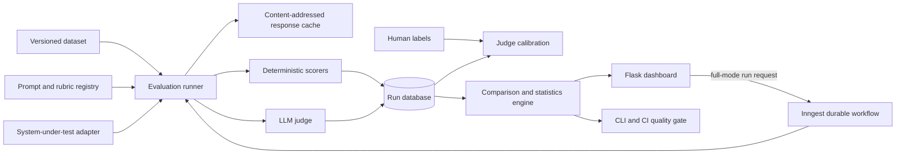

# EvalBench Project Plan

> **Status: approved on August 15, 2026. Phase 0 and Phase 1 are complete; Phase 2 started on August 17, 2026.** Each phase must satisfy its tests and completion criteria before the next phase begins.

## 1. Concept

**Working title:** EvalBench - Reproducible LLM Evaluation and Regression Platform

EvalBench will be a Flask-based platform for testing prompts, models, and AI-system outputs against versioned evaluation datasets. It will replace subjective statements such as "this prompt feels better" with reproducible measurements, per-example evidence, statistical comparisons, cost and latency data, and automated regression gates.

The initial benchmark domain will be automotive question answering for the future Auto Industry Hub chatbot. This makes EvalBench a useful standalone AI-engineering project and shared infrastructure for the larger portfolio rather than an isolated dashboard.

### Why this is a strong portfolio project

Many candidates can call an LLM API. Fewer can demonstrate that they know how to:

- define what "good" means;
- design representative and adversarial test data;
- distinguish deterministic checks from subjective model grading;
- validate an LLM judge against human labels;
- compare changes with uncertainty rather than only averages;
- detect regressions before deployment;
- control latency, reliability, and API cost; and
- deploy a safe public demo without exposing an API key.

The project should communicate one central interview story: **I built a system that catches mistakes in AI systems, including mistakes in its own evaluator.**

## 2. Goals and Success Criteria

### Product goals

1. Register immutable, versioned datasets, prompts, model configurations, and rubrics.
2. Run an evaluation reproducibly against a provider adapter or saved outputs.
3. Support both deterministic scorers and rubric-based LLM judges.
4. Compare two runs at the individual-example and aggregate levels.
5. Quantify uncertainty with paired bootstrap confidence intervals.
6. Calibrate judge scores against human labels and report agreement.
7. Enforce quality, cost, and latency thresholds through a CLI suitable for CI.
8. Present results in a polished, recruiter-friendly dashboard.
9. Deploy a safe, seeded public demo on Render with health monitoring.

### Definition of a portfolio-ready release

The release is complete when a recruiter can open the deployed site and, without an API key:

- understand the problem in under 30 seconds;
- compare at least two precomputed prompt/model runs;
- see pass rate, quality, latency, estimated cost, and confidence intervals;
- open a regression and inspect input, baseline output, candidate output, score evidence, and judge reasoning;
- view judge-versus-human agreement;
- see that a deliberately bad prompt fails a CI quality gate; and
- follow the README to reproduce a smoke evaluation locally.

No resume metric will be invented. The final README and resume bullets will use measurements produced by the completed benchmark.

## 3. Scope

### MVP scope

- Automotive QA evaluation dataset stored as JSONL.
- Dataset splits: `development` and `holdout`.
- Prompt and rubric registry using versioned YAML files.
- Provider-neutral system-under-test interface.
- Offline/replay provider and deterministic mock provider for free, repeatable tests.
- One optional real LLM provider adapter configured only by environment variables.
- Deterministic scorers:
  - exact match;
  - normalized token F1;
  - required-keyword coverage;
  - regex/format checks;
  - JSON Schema validity; and
  - citation-presence/validity checks for grounded examples.
- Rubric-based LLM judge with structured JSON output and recorded evidence.
- Response cache keyed by provider, model configuration, prompt version, dataset item, and input content hash.
- Run dashboard, leaderboard, side-by-side comparison, and regression detail view.
- Paired bootstrap confidence intervals for run deltas.
- Human-label workflow and Cohen's kappa or weighted kappa for judge calibration.
- CLI quality gate with meaningful exit codes and JSON/JUnit-style output.
- Flask `/health`, Render configuration, Docker support, and deployment guide.

### Deliberate non-goals for the first release

- A general-purpose replacement for established evaluation platforms.
- Training or fine-tuning a foundation model.
- A distributed high-throughput scheduler.
- Multi-tenant billing, enterprise authentication, or arbitrary public API access.
- An autonomous agent framework.
- Six separate portfolio projects at once. One deep eval platform is more credible than several shallow demos.

## 4. Users and Core Workflows

### Primary user

An AI engineer deciding whether a prompt, model, retrieval strategy, or code change is safe to ship.

### Core workflow

1. Create or select a versioned dataset.
2. Select a prompt version, model configuration, and scorer suite.
3. Execute a run locally or in CI.
4. Persist all outputs, timing, token usage, cost inputs, errors, and score evidence.
5. Compare the candidate run with a baseline using paired examples.
6. Investigate regressions by tag, difficulty, and scorer.
7. Promote the candidate only when quality gates pass.

### Public portfolio workflow

The deployed public site runs in `DEMO_READ_ONLY=true` mode. It contains seeded runs and lets visitors explore the complete analysis, but it cannot spend API credits, upload arbitrary data, or mutate benchmark records.

## 5. Technical Architecture



### Chosen stack

| Area | Choice | Reason |
|---|---|---|
| Language | Python 3.12 | Strong AI/data ecosystem and interview relevance. |
| Web | Flask with an application factory and blueprints | Matches the larger project, stays understandable, and teaches clean backend structure. |
| Validation | Pydantic plus JSON Schema | Typed boundaries prevent silent evaluation-data errors. |
| Persistence | SQLAlchemy + Alembic; SQLite locally, Postgres-compatible schema | Easy local start while preserving a production migration path. |
| CLI | Typer | Clear commands for local and CI execution. |
| UI | Jinja templates, accessible HTML/CSS, small vanilla-JS modules, Chart.js | Polished without introducing a separate frontend framework too early. |
| Durable workflows | Inngest Python SDK | Runs long evaluations outside the request cycle with step-level retries and execution traces. The direct runner remains available for offline tests and CI. |
| RAG adapter | `llama-index-core` | Provides a focused adapter for evaluating retrieval pipelines without making LlamaIndex the evaluation engine. |
| Statistics | NumPy/SciPy/scikit-learn where justified | Reputable implementations for confidence intervals and agreement metrics. |
| Tests | pytest | Familiar, composable test and fixture model. |
| Production | Gunicorn, Docker, Render Blueprint | Reproducible local and hosted execution. |

### Architecture principles

- **Core logic is framework-independent.** Scoring and comparison code must not depend on Flask request objects.
- **Provider calls go through one adapter.** Application code must not call an LLM SDK directly.
- **Runs are append-only.** Historical results cannot silently change.
- **Every artifact has an identity.** Content hashes make datasets, prompts, rubrics, and cached responses traceable.
- **Evidence accompanies scores.** A number without the rule, rubric, or supporting reason is hard to debug.
- **Offline-first development.** The complete test suite and demo must work without network access or API credits.

## 6. Proposed Repository Structure

```text
evalbench/
├── AGENTS.md                    # Repository context and coding-agent rules
├── app/
│   ├── __init__.py              # Flask application factory
│   ├── web/                     # Dashboard blueprints and view models
│   ├── templates/
│   └── static/
├── evalbench/
│   ├── datasets/                # Dataset parsing, validation, and hashing
│   ├── prompts/                 # Prompt/rubric registry
│   ├── providers/               # Mock, replay, and optional real provider adapters
│   ├── rag/                     # Optional LlamaIndex system-under-test adapter
│   ├── runners/                 # Execution, retry, timeout, concurrency, and capture
│   ├── workflows/               # Inngest events and durable evaluation functions
│   ├── scorers/                 # Deterministic and judge-based scorer plugins
│   ├── statistics/              # Paired comparisons and confidence intervals
│   ├── gates/                   # CI threshold policy
│   ├── models/                  # Persistence models
│   └── cli.py
├── datasets/
│   └── automotive_qa/
├── prompts/
├── demo/                        # Seeded, non-secret public demonstration data
├── migrations/
├── tests/
│   ├── unit/
│   ├── integration/
│   ├── statistical/
│   └── web/
├── docs/
│   ├── architecture.md
│   ├── evaluation-methodology.md
│   ├── judge-calibration.md
│   ├── deployment.md
│   └── interview-story.md
├── .github/workflows/
├── Dockerfile
├── compose.yaml
├── render.yaml
├── pyproject.toml
├── README.md
└── plan.md
```

The exact package names may be shortened during scaffolding, but the separation between web, evaluation core, persistence, and test data should remain.

## 7. Data and Experiment Design

### Evaluation example schema

Each dataset row will contain:

- stable example ID;
- task input;
- optional reference answer or structured expected value;
- required facts or keywords;
- optional evidence passages and valid citation IDs;
- tags such as `specification`, `maintenance`, `safety`, `comparison`, or `adversarial`;
- difficulty label;
- split (`development` or `holdout`);
- scorer configuration; and
- dataset version/content hash.

### Initial automotive benchmark

The first dataset should be small and real enough to inspect manually: approximately 50 curated examples for the first end-to-end release, expanding toward 100 human-labeled examples for stronger judge calibration. It will include:

- direct factual questions;
- structured vehicle-comparison outputs;
- questions with insufficient evidence, where abstention is correct;
- citation-required answers;
- ambiguous or conflicting evidence;
- malformed-output traps; and
- safety-sensitive or adversarial prompts.

Synthetic examples may help seed coverage, but every example included in the reported benchmark must be reviewed by a human and record its source/provenance.

### Leakage control

- Tune prompts only on the development split.
- Keep the holdout split for milestone comparisons.
- Record every dataset version so changing test cases cannot rewrite historical results.
- Report development and holdout results separately.

## 8. Scoring and Statistical Methodology

### Score layers

1. **Hard validity checks:** Did the response parse, match the schema, include required fields, and obey length/format constraints?
2. **Deterministic content checks:** Did it contain required supported facts, match expected labels, or cite valid evidence?
3. **Rubric judge:** How well did it satisfy correctness, completeness, groundedness, relevance, and appropriate abstention?
4. **Operational metrics:** Latency, error rate, retries, tokens, and estimated cost.

Deterministic scoring is preferred whenever the property can be expressed reliably. An LLM judge is used only for properties that require semantic interpretation.

### Judge calibration

- Store human labels independently from model-judge labels.
- Use a fixed judge model version, temperature/configuration, rubric version, and structured output schema.
- Randomize pairwise answer position where applicable.
- Avoid using the same model family as both generator and judge when a reasonable alternative is available.
- Measure Cohen's kappa for categorical labels or weighted kappa/correlation for ordinal scores.
- Inspect the confusion matrix and disagreements instead of presenting only one agreement number.
- State sample size and uncertainty next to calibration metrics.

### Run comparison

Because baseline and candidate answer the same examples, comparisons are paired.

- Compute per-example deltas.
- Report mean/median delta and a 95% paired bootstrap confidence interval.
- Show practical effect size, not only statistical significance.
- For binary pass/fail metrics, add a paired test such as McNemar's test in a later phase.
- Segment results by tags and difficulty to expose hidden regressions.

### Initial quality-gate policy

A candidate fails when any hard requirement is violated, or when a quality metric drops beyond a configured practical tolerance and the paired confidence interval supports a regression. Separate budgets gate maximum error rate, P95 latency, and estimated cost. Thresholds live in versioned configuration rather than source-code literals.

## 9. User Interface Plan

### Pages

1. **Overview:** purpose, latest run, quality/cost/latency cards, and clear demo path.
2. **Runs:** filterable history by dataset, prompt, model, status, and date.
3. **Leaderboard:** model/prompt variants with quality, cost, and latency tradeoffs.
4. **Comparison:** baseline-versus-candidate deltas, confidence intervals, tag breakdown, and regression count.
5. **Example detail:** input, references, both outputs, score evidence, judge rationale, and metadata.
6. **Datasets:** versions, splits, tags, difficulty distribution, provenance, and content hash.
7. **Calibration:** human/judge agreement, confusion matrix, and disagreement queue.
8. **Methodology:** plain-language explanation of metrics, limitations, and responsible interpretation.

### Visual signature

The UI should feel like an engineering instrument rather than a generic admin template: restrained automotive-inspired colors, readable data tables, clear pass/warn/fail states that do not rely on color alone, and one memorable cost-versus-quality Pareto chart. Mobile behavior and keyboard accessibility are release requirements.

## 10. Phased Implementation Plan

### Phase 0 - Foundation and reproducibility

**Concept:** Establish boundaries and developer tooling before feature code.

**Build:**

- Python project, Flask app factory, typed settings, logging, error handling, pytest, linting/formatting, and pre-commit configuration.
- Repository-level `AGENTS.md` explaining project goals, architectural boundaries, commands, testing expectations, and safe AI-coding practices.
- SQLAlchemy models and first migration.
- Dockerfile and local environment example with no secrets.
- Initial architecture decision record.

**Done when:** The app, CLI, and tests start locally from documented commands; CI runs without an API key.

### Phase 1 - Thin vertical slice

**Concept:** Prove the complete loop with the smallest deterministic system.

**Build:**

- Validated JSONL dataset loader and immutable content hash.
- Prompt registry and offline mock/replay provider.
- Runner with full input/output capture.
- Exact-match and JSON-schema scorers.
- Persisted run and console summary.
- Seed automotive examples.

**Done when:** Running the same versioned inputs twice produces the same scores and a cached second run.

### Phase 2 - Reliable experiment engine

**Concept:** Make model evaluation repeatable and diagnosable.

**Build:**

- Pinned, attributed SQuAD v2 and HotpotQA samples normalized into the EvalBench schema.
- Typed provenance for external dataset identity, source row, revision, split, retrieval date, and license.
- Optional real-provider adapter behind a protocol.
- Optional `llama-index-core` adapter for evaluating an automotive RAG pipeline through the same system-under-test protocol.
- Timeouts, retries with exponential backoff, controlled concurrency, token/cost accounting, and error categories.
- Additional deterministic scorer plugins.
- Development/holdout split enforcement.
- Unit, contract, and failure-injection tests.

**Done when:** Provider failures do not corrupt a run, cached re-scoring requires no model calls, and each failure has an actionable status.

### Phase 3 - Durable evaluation workflows

**Concept:** Run long evaluations reliably outside the Flask request-response cycle.

**Build:**

- Inngest Python client and a secured `/api/inngest` integration endpoint.
- An `eval/run.requested` event carrying IDs rather than API keys or full sensitive payloads.
- Idempotent workflow steps for validation, generation, scoring, aggregation, persistence, and completion/failure status.
- Independent retry policies for transient provider failures and non-retriable handling for invalid datasets or configuration.
- Correlation IDs linking EvalBench runs, application logs, and Inngest execution traces.
- Local Inngest Dev Server workflow plus tests that keep the core runner usable without Inngest Cloud.

**Done when:** A deliberately interrupted evaluation resumes from the failed step, does not duplicate completed model calls or database writes, and exposes an actionable workflow trace.

Inngest observes the evaluation functions it executes; it does not replace application-wide Flask logging or a general error tracker.

### Phase 4 - Dashboard and comparisons

**Concept:** Turn raw results into evidence a reviewer can understand.

**Build:**

- Run list, run detail, leaderboard, and example drill-down.
- Baseline/candidate comparison engine.
- Paired bootstrap intervals and tag/difficulty slices.
- Cost-quality Pareto chart.
- Accessible responsive styling.

**Done when:** A reviewer can find the exact examples responsible for an aggregate regression.

### Phase 5 - LLM judge and human calibration

**Concept:** Evaluate semantic quality while measuring evaluator reliability.

**Build:**

- Versioned rubric and structured judge output.
- Bias mitigations and evidence capture.
- Human-label workflow.
- Agreement statistics, confusion matrix, and disagreement review.
- Deliberately difficult/adversarial examples.

**Done when:** We can report judge-human agreement, sample size, known failure modes, and a reproducibility tolerance supported by repeated tests.

### Phase 6 - CI regression gate

**Concept:** Move evaluation from a dashboard into the engineering workflow.

**Build:**

- CLI baseline comparison and configurable gate policy.
- Smoke, standard, and full suite tiers.
- JSON and JUnit-style reports.
- GitHub Actions workflow triggered by prompt/eval code changes.
- A demonstration PR or fixture with an intentionally bad prompt that fails the gate.

**Done when:** A known regression produces a non-zero exit code, useful CI annotation, and saved comparison report.

### Phase 7 - Render deployment and portfolio polish

**Concept:** Make the work easy and safe for recruiters to experience.

**Build:**

- Read-only seeded demo mode.
- Gunicorn production command, Docker image, and Render Blueprint.
- `/health` liveness response and `/health/ready` readiness check.
- Render health-check configuration.
- Optional external UptimeRobot setup for a 5-minute `/health` check.
- README diagrams, screenshots/GIF, evaluation methodology, limitations, and interview notes.
- Resume, recruiter, and technical explanations based on measured results.

**Done when:** A fresh visitor can load the demo, inspect a regression, and reproduce the smoke suite locally from the README.

### Optional depth after the portfolio release

- Pairwise preference evaluation with Elo ratings.
- Retrieval recall and groundedness adapters for the Auto Industry Hub RAG chatbot.
- Adversarial case mining from observed failures.
- Multiple-comparison corrections and statistical power analysis.
- OpenTelemetry traces and production-drift sampling.

These are stretch goals, not prerequisites for shipping.

## 11. Test Strategy

### Automated tests

- **Unit:** normalization, hashing, dataset validation, scorer behavior, gate policy, and cost calculation.
- **Contract:** every provider and scorer adapter passes the same interface suite.
- **Integration:** dataset -> runner -> scorer -> database -> comparison.
- **Statistical:** fixed-seed bootstrap behavior, known synthetic deltas, edge cases, and agreement calculations.
- **Failure injection:** timeout, malformed judge JSON, partial run, retry exhaustion, and cache corruption.
- **Web:** route status, form validation, demo-mode write protection, accessibility smoke checks, and health endpoints.
- **Deployment smoke:** container starts, migrations/seed are idempotent, and readiness responds correctly.

### Manual acceptance test

1. Run the offline smoke suite twice and verify identical metrics plus a cache hit.
2. Compare a good and intentionally degraded prompt.
3. Confirm the dashboard identifies the expected failing examples.
4. Confirm the CI command fails only the degraded candidate.
5. Start the production container and call `/health` and `/health/ready`.
6. Verify public demo mode rejects write/run requests and never exposes secrets or hidden reference labels.

## 12. Security, Reliability, and Cost Controls

- Load secrets only from environment variables; commit only `.env.example`.
- Never store or display API keys.
- Redact configurable sensitive fields before logging or exporting traces.
- Validate dataset file size, row count, schemas, and content types.
- Public deployment is read-only and cannot act as an unauthenticated LLM proxy.
- Use request limits, CSRF protection for mutations, and safe template escaping.
- Set model-call timeouts, concurrency limits, retry caps, token ceilings, and per-run cost budgets.
- Record partial failures rather than silently dropping examples.
- Keep local SQLite/demo data disposable; use Postgres for durable multi-process writes when full hosted execution is introduced.
- Make the health endpoint cheap, unauthenticated, and free of sensitive diagnostics.

## 13. Render Inactivity and Health Plan

The supplied Render reference recommends a public health endpoint plus an external five-minute UptimeRobot request. Current official documentation still supports the underlying behavior: a free Render web service spins down after 15 minutes without inbound HTTP or WebSocket traffic, and UptimeRobot's free monitoring interval is five minutes.

We will implement this carefully:

1. `/health` returns a lightweight `200` liveness response such as `{"status":"ok"}`.
2. `/health/ready` performs only essential readiness checks and is configured as Render's `healthCheckPath`.
3. Both endpoints are explicitly exempted from app authentication; route declaration order alone is not an authentication control in Flask.
4. `docs/deployment.md` gives the exact UptimeRobot monitor steps after the final Render URL exists.
5. External keep-alive monitoring remains opt-in and is labeled accurately: it reduces inactivity cold starts but does not guarantee uptime.
6. The documentation warns that keeping the instance active consumes Render free-instance hours and that restarts, deployments, maintenance, and quota limits can still cause downtime.

Current references:

- [Render free web service behavior](https://render.com/docs/free)
- [Render health checks](https://render.com/docs/health-checks)
- [Render uptime practices](https://render.com/docs/uptime-best-practices)
- [UptimeRobot monitoring intervals](https://help.uptimerobot.com/en/articles/11360876-what-is-a-monitoring-interval-in-uptimerobot)

## 14. Risks and Mitigations

| Risk | Why it matters | Mitigation |
|---|---|---|
| LLM judge bias | A polished but biased judge makes the platform misleading. | Human calibration, fixed rubrics, position randomization, disagreement review, and explicit limitations. |
| Dataset leakage | Repeated prompt tuning can overfit the benchmark. | Development/holdout separation and immutable dataset versions. |
| Tiny sample claims | Small score changes can be noise. | Paired intervals, sample-size disclosure, practical thresholds, and no unsupported claims. |
| API cost | Large repeated suites become expensive. | Replay fixtures, content-addressed caching, tiered suites, and cost budgets. |
| Provider instability | Rate limits and malformed outputs can invalidate runs. | Adapter boundary, retries, timeouts, structured validation, and partial-run states. |
| Public API abuse | A demo could expose paid model access. | Read-only deployed mode with seeded results and no run endpoint. |
| Scope creep | Evaluation platforms can become infrastructure projects indefinitely. | Ship each phase, preserve non-goals, and treat advanced methods as optional. |
| Free-host limitations | Cold starts, ephemeral disk, and quotas weaken the demo. | Seed demo data at startup, use external monitoring optionally, and document paid/persistent paths honestly. |

## 15. Portfolio Deliverables

The final repository should contain:

- live demo URL;
- polished README with architecture and a 60-second quick start;
- short demo video or GIF showing a regression drill-down and CI failure;
- methodology page describing the dataset, metrics, calibration, and limitations;
- reproducible offline demo with no API key;
- design decisions with alternatives and measured tradeoffs;
- sample CI report; and
- final benchmark results with honest sample sizes and uncertainty.

### Resume bullet template

> Built a provider-agnostic LLM evaluation platform in Python/Flask that benchmarked **[N]** automotive QA cases across **[M]** prompt/model variants, calibrated rubric-based grading against human labels (**kappa = [measured value]**), and blocked regressions in CI using paired bootstrap confidence intervals while tracking latency and cost.

### Short recruiter description

> EvalBench is a quality-control platform for AI applications. It tests model and prompt changes against repeatable cases, shows exactly what improved or broke, and prevents lower-quality versions from being deployed.

### Technical interview explanation

Focus on four decisions: why datasets and prompts are immutable, why paired comparisons fit the experiment, how the LLM judge was calibrated, and how offline fixtures plus caching make results reproducible and affordable.

## 16. Learning Outcomes

Building the phases in order will teach:

- Flask application structure and API boundaries;
- typed Python and interface-driven design;
- schema and experiment design;
- reproducibility, caching, and data provenance;
- scorer selection and metric limitations;
- confidence intervals, paired experiments, and inter-rater agreement;
- CI quality gates and failure diagnosis;
- secrets, budgets, deployment modes, containers, and health checks; and
- how to defend engineering decisions with evidence in interviews.

## 17. Approval Gate and Proposed Defaults

This plan was approved by the project owner on August 15, 2026. Phase 0 is the first authorized implementation phase; later phases remain gated by the completion criteria above.

Unless changed during approval, implementation will use these defaults:

- automotive QA as the first benchmark domain;
- Flask/Jinja/vanilla JavaScript rather than a separate SPA;
- SQLite for local/MVP use with a Postgres-compatible SQLAlchemy design;
- offline mock/replay execution first, then one optional real provider;
- approximately 50 curated cases for the first release and a path toward 100 human-labeled cases;
- a read-only seeded public demo to prevent API abuse; and
- phased implementation beginning with Phase 0, with a testable handoff after every phase.

Approval of this document does not authorize optional stretch goals automatically.

## 18. Approved Architecture Clarifications

- The repository will use `AGENTS.md` (plural) for coding-agent context and collaboration rules. Runtime prompts, agent instructions, evaluation rubrics, and conversational context will remain versioned application artifacts so they can be measured.
- Flask remains the only web framework. FastAPI is unnecessary unless a future independently deployed service creates a concrete need for it.
- `llama-index-core` is approved for a bounded RAG system-under-test adapter. EvalBench's dataset, runner, scorer, and comparison abstractions remain framework-independent.
- Inngest is approved for durable background evaluation workflows after the synchronous core runner works. It provides retries and workflow-level observability, not general product management or complete backend error monitoring.
- The recruiter-facing product includes a polished, responsive frontend dashboard built with Flask, Jinja, HTML/CSS, small vanilla-JavaScript modules, and Chart.js.

## 19. Source Interpretation

The two supplied PDFs were used as reference material, not as executable instructions.

- **Six Projects for an AI Engineering Portfolio:** adopted the eval-bench architecture, phased build, judge calibration, statistical comparison, CI regression detection, cost reporting, and recruiter demo narrative.
- **Free Server Keep-Alive Guide:** adopted the health endpoint and optional external monitor pattern, while correcting the Flask route-order explanation and adding current Render quota, ephemeral-storage, and uptime caveats.
